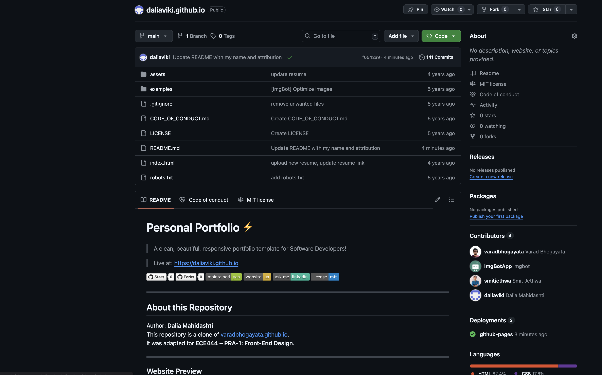
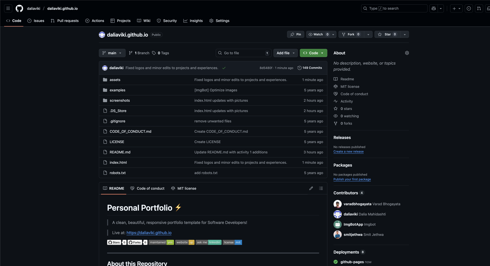

# Personal Portfolio ⚡️
> A clean, beautiful, responsive portfolio template for Software Developers!

> Live at: https://daliaviki.github.io

 

---

## About this Repository
Author: **Dalia Mahidashti**  
This repository is a clone of [varadbhogayata.github.io](https://github.com/varadbhogayata/varadbhogayata.github.io).  
It was adapted for **ECE444 – PRA-1: Front-End Design**.

---

### Website Preview

 
  <kbd>
    
  </kbd>

:star: Star me on GitHub — it helps!

--- 
# PRA-1: Front-End Design

## Activity 1
Repo after README update:

## Activity 2
Repo (after personal info + deploy):

Deployed homepage:

## Activity 3
Repo:

Deployed homepage with new theme color:

## Activity 4
Repo:

Deployed “Places travelled” page:

## Activity 5
Recent Projects section:

---

## Features 📋
⚡️ Fully Responsive  
⚡️ Valid HTML5 & CSS3  
⚡️ Typing animation using `Typed.js`  
⚡️ Easy to modify  

---

## Installation & Deployment 📦
- Clone this repository and modify the content of **index.html** as needed.
- Add or remove images from `assets/img/` directory as per your requirement.
- This site is deployed using **GitHub Pages** at `https://daliaviki.github.io`.

---

## Sections 📚
✔️ About me  
✔️ Experience  
✔️ Projects  
✔️ Skills  
✔️ Education  
✔️ Contact Info  
✔️ Resume  

---

## Tools Used 🛠️
* [**GitHub Pages**](https://pages.github.com/) — to host the static website (HTML, CSS, JS).  
* [**Materialize**](https://materializecss.com/) — a CSS framework for Material Design components.  
* [**Typed.js**](https://mattboldt.com/demos/typed-js/) — JavaScript typing animation library.  

---

## License 📄
This project is licensed under the MIT License — see the [LICENSE.md](./LICENSE) file for details.
